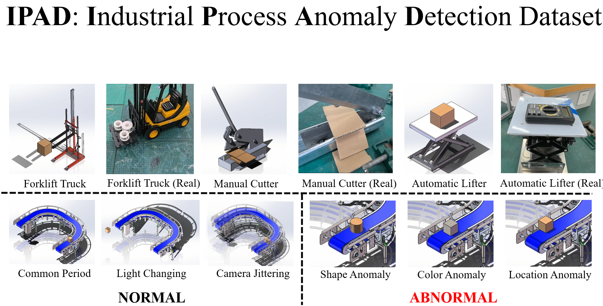

# IPAD: Industrial Process Anomaly Detection Dataset

<p align="left">
    <a href='https://arxiv.org/abs/2404.15033'>
      
    </a>
    <a href='https://ljf1113.github.io/IPAD_VAD'>
      
    </a>
    <a href='https://drive.google.com/file/d/1SwSScNzhzE6t8N9JxK843SsqthmFdZIv/view?usp=drive_link'>
      
    </a>
</p>

[//]: # (<video src="page.mp4" controls="controls" width="1080" height="720"></video>)


## Abstract

Video anomaly detection (VAD) is a challenging task aiming to recognize anomalies in video frames, and existing large-scale VAD researches primarily focus on road traffic and human activity scenes. In industrial scenes, there are often a variety of unpredictable anomalies, and the VAD method can play a significant role in these scenarios. However, there is a lack of applicable datasets and methods specifically tailored for industrial production scenarios due to concerns regarding privacy and security. To bridge this gap, we propose a new dataset, IPAD, specifically designed for VAD in industrial scenarios. The industrial processes in our dataset are chosen through on-site factory research and discussions with engineers. This dataset covers 16 different industrial devices and contains over 6 hours of both synthetic and real-world video footage. Moreover, we annotate the key feature of the industrial process, i.e., periodicity. Based on the proposed dataset, we introduce a period memory module and a sliding window inspection mechanism to effectively investigate the periodic information in a basic reconstruction model. Our framework leverages LoRA adapter to explore the effective migration of pretrained models, which are initially trained using synthetic data, into real-world scenarios. Our proposed dataset and method will fill the gap in the field of industrial video anomaly detection and drive the process of video understanding tasks as well as smart factory deployment.

## Dataset Statistics

[//]: # (## Introduction)
[//]: # (![]&#40;assets/model.png&#41;)

## Training
```
python train.py --dataset_type [Your dataset] --model [Model name] --epochs [Epochs]
```

## Evaluating
```
python evaluate.py --dataset_type [Your dataset] --model [Model name] --model_dir [Checkpoint path] --img_dir [Optional] --vid_dir [Optional]
```

## Acknowledgments
Our code is based on [LearningNotToReconstructAnomalies](https://github.com/aseuteurideu/LearningNotToReconstructAnomalies). Thanks for the great project.

## Citation
```text
@article{liu2024ipad,
  author    = {Jinfan Liu, Yichao Yan, Junjie Li, Weiming Zhao, Pengzhi Chu, Xingdong Sheng, Yunhui Liu and Xiaokang Yang},
  title     = {IPAD: Industrial Process Anomaly Detection Dataset},
  year      = {2024},
  journal   = {arXiv preprint arXiv:2404.15033},
}
```
